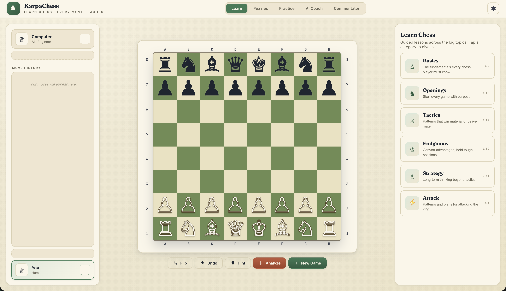

# ♞ KarpaChess

> **Learn Chess · Every Move Teaches**
> A focused, beautiful, fully-offline chess learning app powered by AI. Pure HTML / CSS / JS — no build step, no dependencies, no tracking.

### 🌐 [Try the live demo →](https://mourad-ghafiri.github.io/KarpaChess)



---

## ✨ Why KarpaChess?

Most chess apps are built for playing. **KarpaChess is built for learning.** Every feature is designed to teach — from step-by-step lessons to themed puzzle sets to AI-powered match review. No leaderboards. No rating grind. No distractions. Just you, the board, and the ideas behind every move.

- 📚 **71 guided lessons** across 6 categories — beginner to advanced, with teach-and-play steps
- 🧩 **100 hand-crafted puzzles** across 8 themes, every one engine-verified
- 🤖 **AI Coach** with 11 providers: Anthropic, OpenAI, OpenRouter, Mistral, DeepSeek, xAI Grok, Qwen, GLM, MiniMax, Ollama, LM Studio — plus a built-in offline coach
- 🔍 **Match Review** — every move you play, compared to the engine's best
- 🎬 **Commentator Studio** — import a PGN, scrub the game, get engine insights on every ply, edit players inline, see the imported clocks tick, draw arrows / circles / freehand / text on the board, explore variations — a full broadcast-ready studio, fully offline
- 💡 **Persistent hints** with arrows drawn right on the board
- 🎨 **Scholar's Library** aesthetic — warm paper tones, serif elegance
- 💾 **100% offline-capable** — runs locally, no accounts, no servers

---

## 🎯 Features

### 📚 Learn — Guided Step-by-Step Lessons

Pick a category, then work through interactive lessons one step at a time. Each lesson alternates between **teach** steps (explanation + illustrative position) and **play** steps (you make the required move on the board). A progress bar tracks you through the lesson; a trophy celebrates completion. The curriculum spans **beginner → intermediate → advanced** in every category.

| Category | Lessons | Sample Topics |
|---|---|---|
| ♙ **Basics** | 9 | How pieces move · Check & mate · Castling · En passant · Piece values · Draws · Notation · Thinking process · Common mistakes |
| ♞ **Openings** | 18 | Opening principles · Italian · Ruy Lopez · London · Sicilian · French · Caro-Kann · Queen's Gambit · English · KIA · Najdorf · King's Indian · Nimzo-Indian · Grünfeld · Catalan · Opening traps |
| ⚔ **Tactics** | 17 | Fork · Pin · Skewer · Back-rank · Discovered attack · Double attack · Remove defender · Deflection · Overloading · Zwischenzug · X-ray · Interference · Trapping pieces · Demolition · Quiet move · Pawn breakthrough · Windmill |
| ♔ **Endgames** | 12 | King activity · K+Q mate · K+R mate · K+P vs K · Opposition · Passed pawns · Philidor · Lucena · Minor piece endings · Opposite bishops · Rook+P vs R · Queen vs pawn |
| ♗ **Strategy** | 11 | Good vs bad pieces · Outposts · Pawn structure · King safety · Space · Weak squares · Open files · Bishop pair · Prophylaxis · Maneuvering · Exchange sacrifice |
| ⚡ **Attack** | 4 | Uncastled king · Opposite-side castling · Greek Gift (Bxh7+) · Rook lift |

### 🧩 Puzzles — Themed Sets

Each theme is a focused pattern you can drill. Solve the puzzle → ghost-back a wrong move with a gentle hint → advance to the next one. No rating, no score, no gamification. Just pattern recognition.

| Theme | Puzzles |
|---|---|
| ♛ Mate in 1 | 31 |
| ♚ Mate in 2 | 3 |
| ♞ Forks | 15 |
| ♝ Pins & Skewers | 11 |
| ♜ Back Rank | 12 |
| 🎯 Discovered Attacks | 5 |
| ♔ Endgame Technique | 5 |
| ⚡ Mixed Tactics | 18 |

### 🎮 Practice — Play the Engine

Play a game against the built-in engine to apply what you've learned. Four difficulty levels (Beginner → Master), any time control from `3+2` to unlimited, play as White, Black, or random. The **Coach Whisper** panel drops contextual tips beside the board after each move. A hint arrow + explanation card appears on demand. Flip, undo, analyze anytime.

### 🔍 Match Review — See Where You Could Have Played Better

When a game ends, you get one clean banner with two options: **Review Match** or **New Game**. Pick Review and every move you made is compared to the engine's top pick. Moves are classified as **Best / Inaccuracy / Mistake / Blunder**, shown in a clickable list. Clicking a move jumps the board to that position and overlays the engine's recommended alternative as an arrow.

### 🎬 Commentator — Match Studio

A full studio for studying or broadcasting games. The right panel has two states: an **Import view** with a paste area + file picker + a short list of curated sample games, and a **Study view** that appears once a game is loaded.

**Import**
- Paste PGN (with variations, NAGs, `{comments}`, `[%clk]`, `[%emt]`), paste a plain move list (`e4 e5 Nf3 Nc6`), or upload a `.pgn` / `.txt` file
- Curated samples load with one click: *Opera Game*, *Kasparov's Immortal*, *Scholar's Mate*, *The Evergreen*
- The **✕** button on the Study view closes the current match and returns to Import — localStorage forgets it too

**Navigate**
- Navigation row with **⏮ ◀ ▶ ⏭** plus keyboard shortcuts (`←` / `→` / `Home` / `End`)
- Click any move in the move tree to jump there
- Creating a move that diverges from the main line automatically forks a variation; **↩ main** returns. While off the main line, the board squares dim to half-opacity (pieces + drawings stay sharp) so there's no doubt you're in a sub-line

**Per-ply auto-analysis**
- Every navigation triggers a short engine search on the previous position, classifies the move against the engine's top choice, and caches the result on the node (subsequent revisits are instant)
- Classifications: **★ Best · ✓ Solid · ?! Inaccuracy · ? Mistake · ?? Blunder**
- A small classification glyph can be shown in the corner of the destination square — toggled by the **eye** button in the nav row. **Off by default** (stream-safe); your choice is remembered
- A green arrow overlays the engine's preferred move whenever it differs from what was played

**Insights panel** (right panel, always visible when a match is loaded)
- Tone-tinted header showing the classification glyph + who played what
- Comparison line: *Engine prefers `Nxc6`* or *Engine agrees — top choice*
- Evaluation in pawn units (`+0.30` / `-1.20` …)
- A short natural-language sentence describing the move — picks up on captures, checks, castling, promotions, and checkmate
- Any `{comment}` from the imported PGN is shown as a blockquote below

**Players (left panel)**
- The existing player cards show the match's names and avatars once a game is loaded
- **Click the name** → inline rename (contenteditable, Enter commits, Esc cancels)
- **Click the avatar** → file picker; photo is auto-downscaled to 192 px JPEG and inlined into localStorage
- **Imported clocks** — if the PGN carries `[%clk]` annotations, the timer slots show remaining time per ply (hover for "time used" tooltip). `[%emt]` as a fallback. Missing clock data shows **—**

**Drawing overlay**
- Drawing tools live in the board-controls row (replacing flip/undo/hint/new while in Commentator mode) — no toggle needed, they're always live
- 8 tools: **Select** (move / resize / rotate selected shape) · **Eraser** · **Arrow** · **Line** · **Rect** · **Circle** · **Pen** (freehand) · **Text** (inline editor — no native prompt dialogs)
- 7-color palette, stroke-width slider, delete-selected + clear-all icon buttons
- Per-tool cursor (arrow for select, crosshair for creation, I-beam for text)
- Shapes store position + rotation; selecting a shape shows corner/edge resize handles and a rotation halo above; drag the body to move
- Double-click a text shape with the Select tool to edit it in place
- Drawings are **per-ply** — navigating away and back restores exactly what you drew on that move

**Move tree**
- Collapsed by default at the bottom of the right panel so screen-sharing a broadcast doesn't spoil the upcoming moves
- Click the **Moves** header to expand; main line + variations, classification badges next to each SAN, click any move to jump there

### 🤖 AI Coach — Ask the Position Anything

Chat with the position. Ask *"What's the plan for both sides?"* or *"Why is Nf3 strong here?"* The coach sees the current FEN, move history, engine evaluation, and legal moves. Choose your provider in Settings:

Every provider ships with a **preset model list** and a **Custom…** option where you can type any exact model identifier.

**☁️ Cloud APIs** — current flagships (April 2026), most-powerful first

| Provider | Endpoint | Sample preset models |
|---|---|---|
| 🟣 **Anthropic** | `api.anthropic.com/v1/messages` | `claude-opus-4-7`, `claude-opus-4-6`, `claude-sonnet-4-6`, `claude-sonnet-4-5-20250929`, `claude-haiku-4-5` |
| 🟢 **OpenAI** | `api.openai.com/v1/chat/completions` | `gpt-5.4`, `o3-pro`, `gpt-5.4-mini`, `o3`, `gpt-4.1`, `gpt-5.4-nano` |
| 🌐 **OpenRouter** | `openrouter.ai/api/v1/chat/completions` | `anthropic/claude-opus-4.7`, `openai/gpt-5.4`, `anthropic/claude-sonnet-4.6`, `google/gemini-3-pro`, `x-ai/grok-4.1-fast`, `deepseek/deepseek-v3.2`, `deepseek/deepseek-r1`, `meta-llama/llama-4-maverick`, `qwen/qwen3-max`, `minimax/minimax-m2.7` — one key unlocks 300+ models |
| 🟠 **Mistral AI** | `api.mistral.ai/v1/chat/completions` | `mistral-large-latest`, `magistral-medium-latest`, `mistral-medium-latest`, `mistral-small-latest`, `codestral-latest`, `pixtral-large-latest`, `ministral-8b-latest` |
| 🔵 **DeepSeek** | `api.deepseek.com/v1/chat/completions` | `deepseek-reasoner` (V3.2 thinking mode), `deepseek-chat` (V3.2 non-thinking) |
| ⚫ **xAI Grok** | `api.x.ai/v1/chat/completions` | `grok-4.20-multi-agent`, `grok-4`, `grok-4-1-fast-reasoning`, `grok-4-fast-reasoning`, `grok-code-fast-1`, `grok-4-1-fast-non-reasoning` |
| 🟡 **Qwen** (Alibaba) | `dashscope-intl.aliyuncs.com/…/compatible-mode/v1` | `qwen3-max`, `qwen3.5-plus`, `qwen3-coder-plus`, `qwq-plus`, `qwen-flash`, `qwen3-coder-flash` |
| 🔴 **GLM** (Zhipu) | `open.bigmodel.cn/api/paas/v4` | `glm-4.6`, `glm-4.5`, `glm-4.5-air`, `glm-4-plus`, `glm-4.6v-flash`, `glm-4-flash` |
| 🟤 **MiniMax** | `api.minimaxi.chat/v1` | `MiniMax-M2.7`, `MiniMax-M2.7-highspeed`, `MiniMax-M2.5`, `MiniMax-M2.1`, `MiniMax-M2` |

**💻 Local / self-hosted** — recent open-weights models

| Provider | Endpoint | Sample preset models |
|---|---|---|
| 🦙 **Ollama** | `http://localhost:11434` | `llama4:scout`, `llama3.3:70b`, `qwen3:32b`, `deepseek-r1:32b`, `gemma3:27b`, `mistral-small:24b`, `phi4:14b` |
| 🖥 **LM Studio** | `http://localhost:1234/v1` | `llama-3.3-70b-instruct`, `qwen3-32b`, `deepseek-r1-distill-qwen-32b`, `gemma-3-27b-it`, `mistral-small-24b-instruct`, `qwen2.5-coder-32b-instruct`, `phi-4` |

**🏠 Offline**

- **Built-in heuristic coach** — runs fully offline: parses the FEN, computes material balance, pawn structure, king safety, loose pieces, development, and phase-of-game, then answers position-specific questions (best move, tactics, plan, evaluation, king safety, pawns, development). 40+ openings named and annotated. No network, no keys, always available.

**Custom URLs** are supported on local providers and Chinese-region providers (Ollama, LM Studio, Qwen, GLM, MiniMax) so you can switch regions or point at a proxy.

API keys are stored **locally in your browser** — calls go directly from your browser to the provider. Nothing is ever sent to a KarpaChess server (there isn't one).

---

## 🎨 The Design

KarpaChess wears a **"Scholar's Library"** aesthetic — deliberately different from the neon/glass look most chess apps go with:

- 🎨 Warm paper-tone palette (cream background, paper-white cards, warm navy ink)
- 🌿 Forest-sage green as the primary action color
- 🍂 Warm terracotta coral for highlights and hints
- ✒️ **Fraunces** serif for headings, Inter for body, JetBrains Mono for move notation
- 🪶 Soft shadows, hairline borders, no backdrop-blur or animated orbs (GPU-friendly)
- 🎭 **5 board themes**: Royal, Emerald (default), Stone, Rose, Ice

---

## ⌨️ Keyboard Shortcuts

| Key | Action |
|---|---|
| **F** | Flip the board |
| **N** | New game |
| **H** | Show hint |
| **Ctrl+Z** / **⌘Z** | Undo move |
| **Esc** | Close modal · clear selection · exit drawing mode |

**Commentator tab** (drawing tools are always live — no toggle needed):

| Key | Action |
|---|---|
| **←** / **→** | Previous / next move (analysis runs automatically on each) |
| **Home** / **End** | Jump to start / end of main line |
| **↑** | Return to main line from a variation |
| **Del** / **Backspace** | Delete the selected shape |
| **Esc** | Deselect |

(Shortcuts are blocked while typing in inputs and while any modal is open.)

---

## 📂 Project Structure

KarpaChess is native ES modules — no build step, no bundler. `index.html` loads `src/app.js` as `<script type="module">` and every other file imports what it needs.

```
learn-chess/
├── index.html             # App shell — 5 tabs, modals, hint card
├── styles.css             # Scholar's Library theme
├── screenshot.png
├── data/                  # Content (lessons + puzzles, pure JSON)
│   ├── lessons/
│   │   ├── index.json
│   │   └── <category>-NN-<slug>.json   # one file per lesson
│   └── puzzles/
│       ├── index.json
│       └── <theme>-NN.json             # one file per puzzle
└── src/
    ├── app.js             # Composition root — wires every module
    ├── core/              # EventBus, constants, DOM helpers (+ imageFileToDataUrl)
    ├── engine/            # chess.js — rules, SAN, FEN, search
    ├── state/             # GameState, PrefsStore, learn/puzzle/review state,
    │                      #  commentator-state (move-tree + path + persistence)
    ├── services/          # Storage, sound, particles, toast, modals, clock, content,
    │                      #  pgn (parse + serialize, variations, NAGs, clocks)
    ├── ai/                # Coach facade + 11 provider implementations
    │   └── providers/     # anthropic, openai, openrouter, mistral, deepseek,
    │                      # xai, qwen, glm, minimax, ollama, lmstudio
    ├── modes/             # GameMode hierarchy (practice/lesson/puzzle/review/commentator)
    ├── ui/                # BoardView, history, player cards, hint, banner,
    │                      #  drawing-overlay, move-tree-view, …
    └── features/          # One controller per tab (practice/learn/puzzles/coach/review/commentator)
```

Each file does one thing. Adding a new AI provider = drop one file in `src/ai/providers/` and register it in `src/app.js`. Adding a tab = drop one controller in `src/features/`. No central switch statements to update — modes/providers are plug-and-play via registries.

**Adding content is easy:** drop a new JSON file in `data/lessons/` or `data/puzzles/`, add its filename to the matching `index.json` array, reload. Done. Every file is auto-discovered at startup.

### 🏗 Architecture notes

- **SOLID + OOP, no build step.** ES modules + plain classes. Runs in any modern browser as-is.
- **EventBus** decouples views from state — views subscribe to `state:changed` / `prefs:changed` and re-render; nothing reaches across module boundaries.
- **Strategy pattern** for AI providers (one `AIProvider` base, `OpenAICompatibleProvider` template method for the many OpenAI-compatible APIs).
- **State pattern** for game modes — replaces what used to be scattered `if (mode === 'lesson')` cascades.
- **Facade** — `CoachService` hides provider selection + fallback behind one `ask(q, ctx)`.

### ▶️ Running locally

The app uses `fetch()` to load content manifests, so it must be served over HTTP:

```bash
python3 -m http.server 8000
# then open http://localhost:8000
```

---

## 🧠 The Engine

`src/engine/chess.js` is a complete, from-scratch chess engine:

- ✅ All legal move generation (pieces, castling, en passant, promotion)
- ✅ Check / checkmate / stalemate / 50-move / insufficient material detection
- ✅ Standard Algebraic Notation (SAN) with disambiguation
- ✅ Forsyth-Edwards Notation (FEN) import/export
- ✅ **Negamax + alpha-beta + quiescence search** with piece-square tables
- ✅ 4 difficulty levels (random-ish → depth-4 with move ordering)

No external chess libraries. No Stockfish WASM. Every line is in the repo.

---

## 📝 Content Schema

### Lesson file

```json
{
  "id": "the-fork",
  "title": "The Fork",
  "summary": "Attack two pieces at once",
  "difficulty": "beginner",
  "steps": [
    {
      "type": "teach",
      "fen": "8/8/2k5/3q4/8/8/2N1K3/8 w - - 0 1",
      "title": "Royal Fork",
      "text": "A fork attacks two pieces in one move..."
    },
    {
      "type": "play",
      "fen": "8/8/2k5/3q4/8/8/2N1K3/8 w - - 0 1",
      "prompt": "Play the knight to fork king and queen.",
      "targetSan": ["Nb4+"],
      "hint": "Nb4 attacks both c6 and d5."
    }
  ]
}
```

### Puzzle file

```json
{
  "id": "mate-in-1-01",
  "fen": "r1bqkb1r/pppp1ppp/2n2n2/4p2Q/2B1P3/8/PPPP1PPP/RNB1K1NR w KQkq - 0 1",
  "solution": ["Qxf7#"],
  "hint": "The queen has a clear diagonal."
}
```

Puzzles with multi-move solutions alternate user / opponent / user: `["dxe5", "dxe5", "Qxd8+"]`. The opponent's reply is played automatically.

---

## 🛡 Privacy & Offline

- 🔒 Everything runs in your browser. There is **no KarpaChess server**.
- 🔑 API keys are stored in `localStorage` — only sent to the provider you configured.
- 📶 The built-in engine + built-in coach work **completely offline**. Ollama and LM Studio keep the AI-coach experience offline too.
- 🎨 Your theme preference, board settings, and lesson completion are stored locally.

---

## 🙌 Credits

Built with ❤️ as a pure client-side app. No external chess libraries. No analytics. No trackers.

Fonts: [Fraunces](https://fonts.google.com/specimen/Fraunces), [Inter](https://fonts.google.com/specimen/Inter), [JetBrains Mono](https://fonts.google.com/specimen/JetBrains+Mono) via Google Fonts.

---

## 📖 License

Do what you want. Learn chess. Teach chess. 🏆
